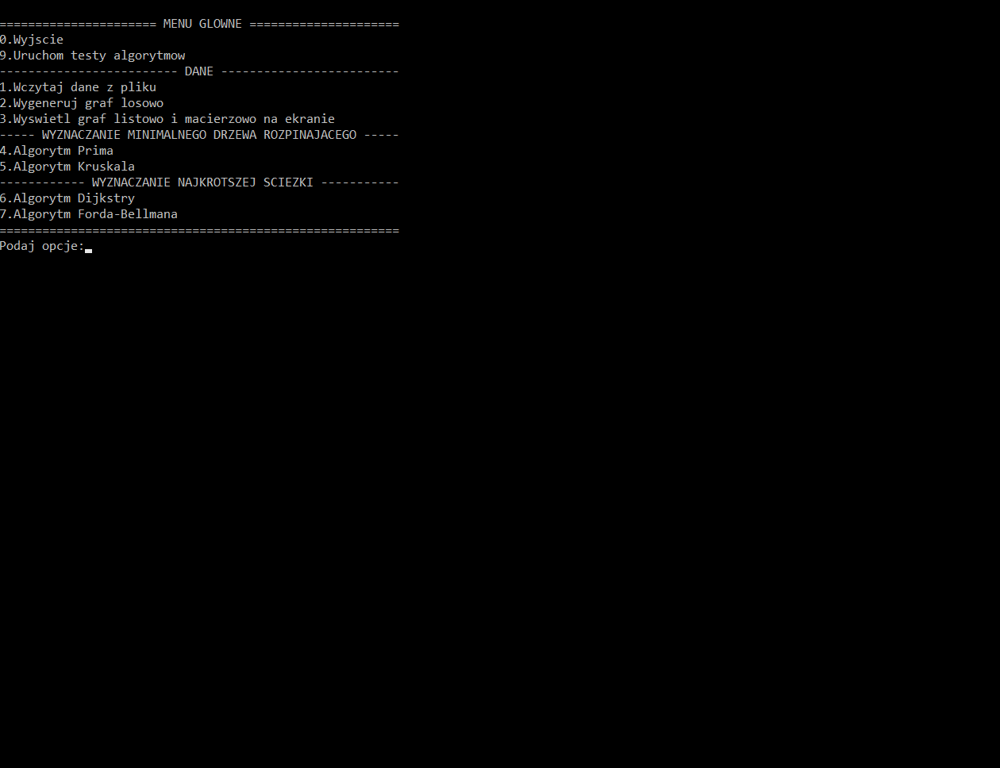
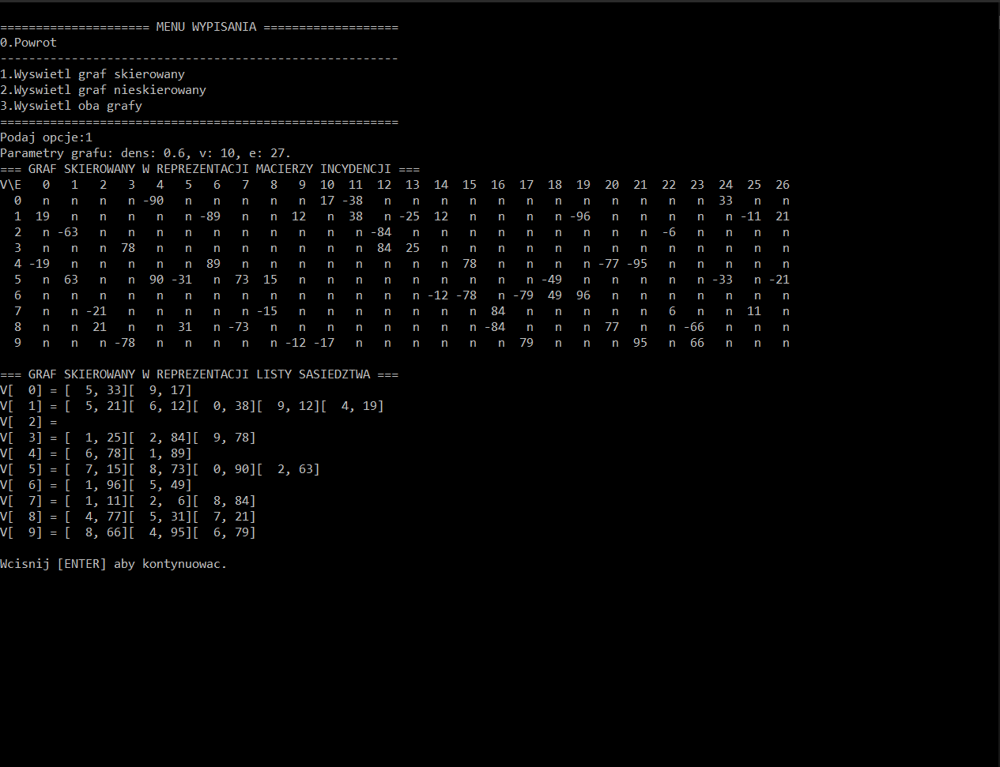
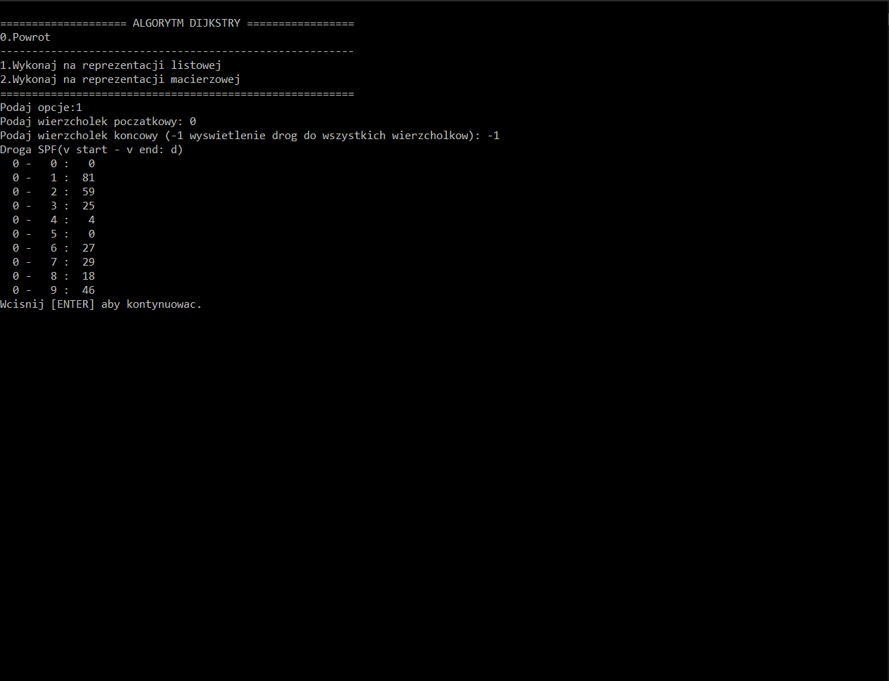

# Graphs
> Graph data structures, minimal spanning tree algorithms and shortest path finding alghoritms C++ implementation.

## Table of contents
- [Graphs](#graphs)
  - [Table of contents](#table-of-contents)
  - [General info](#general-info)
  - [Screenshots](#screenshots)
  - [Technologies](#technologies)
  - [Setup and run](#setup-and-run)
  - [Features](#features)
  - [Issues](#issues)
  - [Status](#status)
  - [Contact](#contact)

## General info
The main goal of this project was to implement following graph data structures and graph algorithms:
* undirected graph:
  * as adjacency list,
  * as incidence matrix;
* directed graph:
  * as adjacency list,
  * as incidence matrix;
* minimal spanning tree algorithms:
  * Prim's algorithm,
  * Kruskal' algorithm;
* shortest path finding algorithms:
  * Bellman–Ford algorithm,
  * Dijkstra's algorithm;

## Screenshots




## Technologies
* C++ Language.

## Setup and run
Download project and compile it with C++ compiler.

Input data file must be placed in the same folder as the program executable file. Structure of file:
```
number_of_edges number_of_vertices  <-- integer values, separated with single space
v_start v_end e_weight  \
v_start v_end e_weight  |- number of lines == number_of_edges
...                     |
v_start v_end e_weight  /
```

## Features
List of features:
* Program can be run in two different modes:
  * Testing mode - it executes a series of tests, where performance of particular operations on each data structure is measuered (time). Results are saved to output file.
  * User mode - with text user interface.
* Avaible operations:
  * Load graph from file.
  * Generate graph (directed/undirected with random/user's parameters).
  * Show graph (directed/undirected as adjacency list/incidence matrix).
  * Run MST algorithms.
  * Run SPF algorithms.


## Issues
No major issues are known.

## Status
This project is finished and no longer developed.

## Contact
Created by [@michaltkacz](https://github.com/michaltkacz) - feel free to contact me!